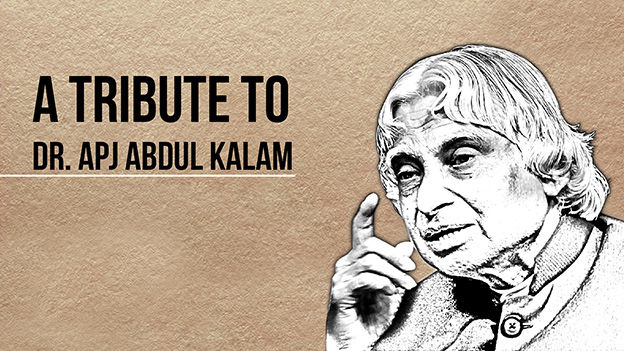

#### OIBSIP_Taskno2
# Tribute Page: Dr. APJ Abdul Kalam

A tribute page dedicated to the memory of Dr. APJ Abdul Kalam, former President of India, renowned scientist, and a great visionary. This page serves as a homage to his life and contributions.

## Table of Contents

- [Introduction](#introduction)
- [About Dr. APJ Abdul Kalam](#about-dr-apj-abdul-kalam)
- [Technologies Used](#technologies-used)
- [How to Contribute](#how-to-contribute)
- [License](#license)

## Introduction

This project is a tribute page created to honor the life and achievements of Dr. APJ Abdul Kalam. It contains information about his life, contributions, and a collection of his quotes. The page is designed to provide a brief overview of his remarkable journey and inspire others to follow in his footsteps.

## About Dr. APJ Abdul Kalam

Dr. APJ Abdul Kalam was a renowned Indian scientist, aerospace engineer, and the 11th President of India. He played a pivotal role in the development of India's space and missile technology. He was also known as the "Missile Man of India" for his significant contributions to the nation's defense capabilities. His life and work continue to inspire millions around the world.

Learn more about Dr. Kalam on the [Wikipedia page](https://en.wikipedia.org/wiki/A._P._J._Abdul_Kalam).

## Technologies Used

This tribute page was created using the following technologies:

- HTML
- CSS

## How to Contribute

If you'd like to contribute to this tribute page, follow these steps:

1. Fork the repository
2. Clone your forked repository to your local machine.
3. Make your changes and improvements.
4. Commit your changes.
5. Push to your forked repository.
6. Create a pull request.

Please make sure your contributions align with the purpose of the project.

## License

This project is licensed under the [MIT License](LICENSE).

---

Feel free to make improvements and add more content to this tribute page. Dr. APJ Abdul Kalam's legacy is worth celebrating and sharing with the world.
